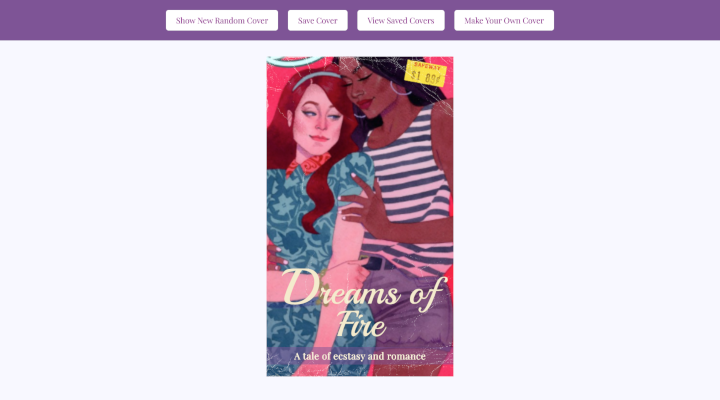

# RomCom  

### Abstract:

App that generates romance novel covers, either random or through user input.

This is a learning project from Turing School Module 1. The project spec & rubric can be found [here](https://frontend.turing.edu/projects/module-1/romcom-pair-v2.html).

### Live Page:

[Link](https://je-jo.github.io/turing-romcom/)

### Preview of App:

### Learning Goals:

DOM Manipulation.

### Wins + Challenges:

Learned to apply event delegation and add event listener to parent container instead of every element.

